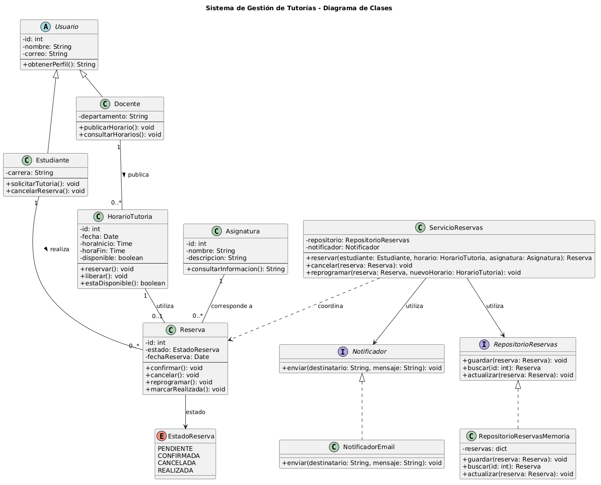

# Sistema de Gestión de Tutorías

Proyecto desarrollado para la asignatura **Diseño de Software - UCOM0310**.

## Descripción

El proyecto consiste en diseñar un Sistema de Gestión de Tutorías aplicando principios de programación orientada a objetos. El sistema permite gestionar estudiantes, docentes, asignaturas, horarios y reservas, procurando que cada elemento tenga una responsabilidad clara dentro de la solución.

La implementación se realizó en **Python y Java**, manteniendo la misma estructura y lógica planteada durante el análisis del dominio y en el diagrama UML.

## Funcionalidades principales

- Gestión de estudiantes y docentes.
- Registro de asignaturas.
- Publicación de horarios disponibles para tutorías.
- Creación de reservas.
- Control del estado de las reservas.
- Cancelación y reprogramación de tutorías.
- Validación de la disponibilidad de los horarios.
- Envío de notificaciones al registrar una reserva.
- Almacenamiento temporal de reservas en memoria.

## Clases principales

### Usuario
Clase abstracta que reúne la información común de los usuarios, como identificador, nombre y correo.

### Estudiante
Hereda de `Usuario` y representa al estudiante que puede solicitar una tutoría.

### Docente
Hereda de `Usuario` y representa al docente encargado de publicar sus horarios disponibles.

### Asignatura
Representa la materia relacionada con cada tutoría.

### HorarioTutoria
Gestiona la fecha, hora y disponibilidad de los horarios publicados por los docentes.

### Reserva
Gestiona la información y el estado de una reserva, relacionando al estudiante con un horario y una asignatura.

### ServicioReservas
Coordina las operaciones necesarias para crear, cancelar y reprogramar las reservas.

### Notificador
Interfaz que define cómo se realizarán las notificaciones dentro del sistema.

### NotificadorEmail
Implementa `Notificador` y representa el envío de notificaciones mediante correo electrónico.

### RepositorioReservas
Interfaz que establece las operaciones necesarias para guardar y consultar las reservas.

### RepositorioReservasMemoria
Implementa `RepositorioReservas` y permite almacenar temporalmente las reservas en memoria.

## Decisiones de diseño

El sistema distribuye las diferentes responsabilidades entre sus clases para evitar concentrar toda la lógica en un solo componente.

Por ejemplo, `ServicioReservas` no trabaja directamente con `NotificadorEmail` ni con `RepositorioReservasMemoria`. En su lugar, utiliza las interfaces `Notificador` y `RepositorioReservas`.

De esta manera, en el futuro se podrían cambiar las formas de notificación o almacenamiento sin tener que modificar directamente la lógica principal de las reservas.

## Principios SOLID aplicados

### Single Responsibility Principle (SRP)

Cada elemento del sistema tiene una responsabilidad específica. `Reserva` gestiona el estado de una reserva, `Notificador` las comunicaciones y `RepositorioReservas` las operaciones relacionadas con el almacenamiento.

Esta separación ayuda a mantener el código más organizado y facilita futuras modificaciones.

### Dependency Inversion Principle (DIP)

`ServicioReservas` depende de las interfaces `Notificador` y `RepositorioReservas` en lugar de trabajar directamente con implementaciones específicas.

Así, la lógica principal de las reservas no queda ligada a una tecnología determinada de notificación o almacenamiento.

## Repositorio

El código fuente, el diagrama UML y la documentación del proyecto se encuentran disponibles en el siguiente repositorio de GitHub:

[Repositorio del Sistema de Gestión de Tutorías](https://github.com/charlielopez0396/sistema-tutorias-LopezCharlie)

## Diagrama UML

El diagrama UML del proyecto se encuentra en:

`docs/modelo-clases.png`

El código fuente de PlantUML se encuentra en:

`docs/modelo-clases.puml`



## Estructura del proyecto

```text
sistema-tutorias/
├── README.md
├── docs/
│   ├── analisis-dominio.md
│   ├── modelo-clases.puml
│   └── modelo-clases.png
└── src/
    ├── python/
    │   └── tutorias/
    │       ├── domain/
    │       ├── notification/
    │       ├── repository/
    │       └── service/
    └── java/
        └── edu/
            └── uees/
                └── tutorias/
                    ├── Main.java
                    ├── domain/
                    ├── notification/
                    ├── repository/
                    └── service/